## Instructions
Answer the following questions and complete the exercises in RMarkdown. Please embed all of your code and push your final work to your repository. Your final lab report should be organized, clean, and run free from errors. Remember, you must remove the `#` for the included code chunks to run. Be sure to add your name to the author header above. For any included plots, make sure they are clearly labeled. You are free to use any plot type that you feel best communicates the results of your analysis.  

Make sure to use the formatting conventions of RMarkdown to make your report neat and clean!  

## Load the libraries

```r
library(tidyverse)
library(janitor)
library(naniar)
```

## Desert Ecology
For this assignment, we are going to use a modified data set on [desert ecology](http://esapubs.org/archive/ecol/E090/118/). The data are from: S. K. Morgan Ernest, Thomas J. Valone, and James H. Brown. 2009. Long-term monitoring and experimental manipulation of a Chihuahuan Desert ecosystem near Portal, Arizona, USA. Ecology 90:1708.

```r
deserts <- read_csv("data/surveys_complete.csv") %>% clean_names()
```

```
## Rows: 34786 Columns: 13
## ── Column specification ────────────────────────────────────────────────────────
## Delimiter: ","
## chr (6): species_id, sex, genus, species, taxa, plot_type
## dbl (7): record_id, month, day, year, plot_id, hindfoot_length, weight
## 
## ℹ Use `spec()` to retrieve the full column specification for this data.
## ℹ Specify the column types or set `show_col_types = FALSE` to quiet this message.
```

1. Use the function(s) of your choice to get an idea of its structure, including how NA's are treated. Are the data tidy?  

```r
glimpse(deserts) #structure of the data
```

```
## Rows: 34,786
## Columns: 13
## $ record_id       <dbl> 1, 2, 3, 4, 5, 6, 7, 8, 9, 10, 11, 12, 13, 14, 15, 16,…
## $ month           <dbl> 7, 7, 7, 7, 7, 7, 7, 7, 7, 7, 7, 7, 7, 7, 7, 7, 7, 7, …
## $ day             <dbl> 16, 16, 16, 16, 16, 16, 16, 16, 16, 16, 16, 16, 16, 16…
## $ year            <dbl> 1977, 1977, 1977, 1977, 1977, 1977, 1977, 1977, 1977, …
## $ plot_id         <dbl> 2, 3, 2, 7, 3, 1, 2, 1, 1, 6, 5, 7, 3, 8, 6, 4, 3, 2, …
## $ species_id      <chr> "NL", "NL", "DM", "DM", "DM", "PF", "PE", "DM", "DM", …
## $ sex             <chr> "M", "M", "F", "M", "M", "M", "F", "M", "F", "F", "F",…
## $ hindfoot_length <dbl> 32, 33, 37, 36, 35, 14, NA, 37, 34, 20, 53, 38, 35, NA…
## $ weight          <dbl> NA, NA, NA, NA, NA, NA, NA, NA, NA, NA, NA, NA, NA, NA…
## $ genus           <chr> "Neotoma", "Neotoma", "Dipodomys", "Dipodomys", "Dipod…
## $ species         <chr> "albigula", "albigula", "merriami", "merriami", "merri…
## $ taxa            <chr> "Rodent", "Rodent", "Rodent", "Rodent", "Rodent", "Rod…
## $ plot_type       <chr> "Control", "Long-term Krat Exclosure", "Control", "Rod…
```


```r
miss_var_summary(deserts) #The NA's are represented by NA
```

```
## # A tibble: 13 × 3
##    variable        n_miss pct_miss
##    <chr>            <int>    <dbl>
##  1 hindfoot_length   3348     9.62
##  2 weight            2503     7.20
##  3 sex               1748     5.03
##  4 record_id            0     0   
##  5 month                0     0   
##  6 day                  0     0   
##  7 year                 0     0   
##  8 plot_id              0     0   
##  9 species_id           0     0   
## 10 genus                0     0   
## 11 species              0     0   
## 12 taxa                 0     0   
## 13 plot_type            0     0
```


```r
summary(deserts)
```

```
##    record_id         month             day            year         plot_id     
##  Min.   :    1   Min.   : 1.000   Min.   : 1.0   Min.   :1977   Min.   : 1.00  
##  1st Qu.: 8964   1st Qu.: 4.000   1st Qu.: 9.0   1st Qu.:1984   1st Qu.: 5.00  
##  Median :17762   Median : 6.000   Median :16.0   Median :1990   Median :11.00  
##  Mean   :17804   Mean   : 6.474   Mean   :16.1   Mean   :1990   Mean   :11.34  
##  3rd Qu.:26655   3rd Qu.:10.000   3rd Qu.:23.0   3rd Qu.:1997   3rd Qu.:17.00  
##  Max.   :35548   Max.   :12.000   Max.   :31.0   Max.   :2002   Max.   :24.00  
##                                                                                
##   species_id            sex            hindfoot_length     weight      
##  Length:34786       Length:34786       Min.   : 2.00   Min.   :  4.00  
##  Class :character   Class :character   1st Qu.:21.00   1st Qu.: 20.00  
##  Mode  :character   Mode  :character   Median :32.00   Median : 37.00  
##                                        Mean   :29.29   Mean   : 42.67  
##                                        3rd Qu.:36.00   3rd Qu.: 48.00  
##                                        Max.   :70.00   Max.   :280.00  
##                                        NA's   :3348    NA's   :2503    
##     genus             species              taxa            plot_type        
##  Length:34786       Length:34786       Length:34786       Length:34786      
##  Class :character   Class :character   Class :character   Class :character  
##  Mode  :character   Mode  :character   Mode  :character   Mode  :character  
##                                                                             
##                                                                             
##                                                                             
## 
```


```r
deserts
```

```
## # A tibble: 34,786 × 13
##    record_id month   day  year plot_id species_id sex   hindfoot_length weight
##        <dbl> <dbl> <dbl> <dbl>   <dbl> <chr>      <chr>           <dbl>  <dbl>
##  1         1     7    16  1977       2 NL         M                  32     NA
##  2         2     7    16  1977       3 NL         M                  33     NA
##  3         3     7    16  1977       2 DM         F                  37     NA
##  4         4     7    16  1977       7 DM         M                  36     NA
##  5         5     7    16  1977       3 DM         M                  35     NA
##  6         6     7    16  1977       1 PF         M                  14     NA
##  7         7     7    16  1977       2 PE         F                  NA     NA
##  8         8     7    16  1977       1 DM         M                  37     NA
##  9         9     7    16  1977       1 DM         F                  34     NA
## 10        10     7    16  1977       6 PF         F                  20     NA
## # ℹ 34,776 more rows
## # ℹ 4 more variables: genus <chr>, species <chr>, taxa <chr>, plot_type <chr>
```

```r
#the data is tidy! 
# each variable has its own column  
# each observation has its own row  
# each value has its own cell  
```


2. How many genera and species are represented in the data? What are the total number of observations? Which species is most/ least frequently sampled in the study?

```r
deserts %>% 
  summarize(n_genera = n_distinct(genus), #amount of genera in the dataset
            n_species = n_distinct(species), #amount of distinct species in dataset
            n_total_observations = n()) #total amount of observations
```

```
## # A tibble: 1 × 3
##   n_genera n_species n_total_observations
##      <int>     <int>                <int>
## 1       26        40                34786
```
In the dataset: 26 genera, 40 species, 34,786 observations. 

```r
deserts %>% 
  count(species) %>% #amount of observations for each species
  arrange(n)
```

```
## # A tibble: 40 × 2
##    species          n
##    <chr>        <int>
##  1 clarki           1
##  2 scutalatus       1
##  3 tereticaudus     1
##  4 tigris           1
##  5 uniparens        1
##  6 viridis          1
##  7 leucophrys       2
##  8 savannarum       2
##  9 fuscus           5
## 10 undulatus        5
## # ℹ 30 more rows
```
^Species that is the least frequently sampled have one observation. (clarki, scutalatus, tereticaudus, tigris, uniparens, viridis)


```r
deserts %>% 
  count(species) %>%
  arrange(desc(n)) #sort most to least observations
```

```
## # A tibble: 40 × 2
##    species          n
##    <chr>        <int>
##  1 merriami     10596
##  2 penicillatus  3123
##  3 ordii         3027
##  4 baileyi       2891
##  5 megalotis     2609
##  6 spectabilis   2504
##  7 torridus      2249
##  8 flavus        1597
##  9 eremicus      1299
## 10 albigula      1252
## # ℹ 30 more rows
```
^Species that is the most frequently sampled merriami with 10,596!

3. What is the proportion of taxa included in this study? Show a table and plot that reflects this count.


```r
deserts %>% 
  count(taxa) %>% 
  arrange(desc(n))
```

```
## # A tibble: 4 × 2
##   taxa        n
##   <chr>   <int>
## 1 Rodent  34247
## 2 Bird      450
## 3 Rabbit     75
## 4 Reptile    14
```


```r
#another way to solve
#taxa_prop <- deserts %>% 
  #tabyl(taxa)
#taxa_prop
```


```r
deserts %>% 
  ggplot(aes(x = taxa, fill = taxa)) +
  geom_bar() + 
  scale_y_log10() + 
  labs(title = "Taxa Represented in Study",
       x = "Taxonomic Group",
       y = "Individuals") + 
  theme(plot.title = element_text(size = rel(1.5), hjust = 0.75)) #move and resize labels
```

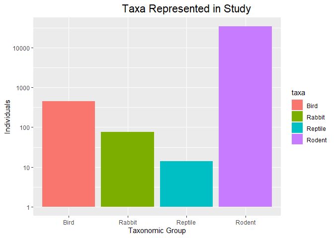<!-- -->
Rodents are studied the most among the taxa data we have available to us. 

4. For the taxa included in the study, use the fill option to show the proportion of individuals sampled by `plot_type.`

```r
deserts %>% 
  ggplot(aes(x = taxa, fill = plot_type))+ #this is the modified line to show the prop. of indiv. sampled by 'plot_type'
  geom_bar()+
  scale_y_log10()+ #fixes viewing for continuous data
  labs(title = "Taxa Represented in Study", 
       x = "Taxa", 
       y = "Number of Observations",
       fill = "Type of Plot") +
  theme(plot.title = element_text(size = rel(1.5), hjust = 0.75))
```

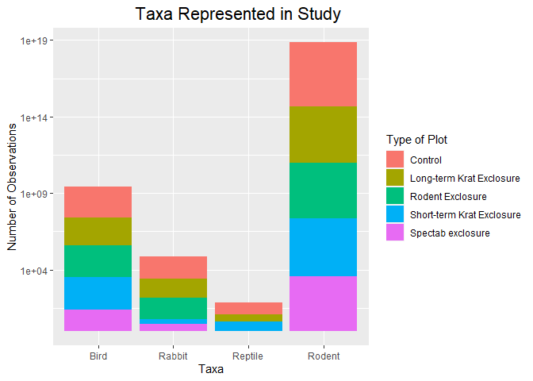<!-- -->

5. What is the range of weight for each species included in the study? Remove any observations of weight that are NA so they do not show up in the plot.
**I Found two ways to do this**

```r
deserts %>% 
  filter(!weight=="NA") %>% 
  ggplot(aes(x=weight, fill=species))+
  geom_boxplot(na.rm = T, position="dodge")+
  scale_y_log10()+
  labs(title = "Weight by Species",
       x= "Weight",
       y= "Species")+
  theme(plot.title=element_text(size=rel(1.5),hjust=0.5))
```

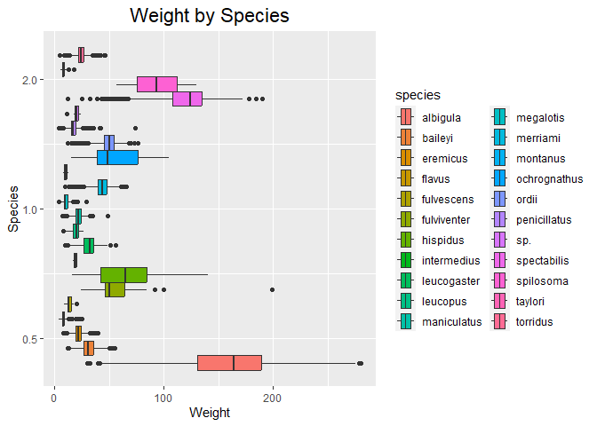<!-- -->


```r
deserts %>% 
  filter(weight != "NA") %>% 
  unite(species_name, "genus", "species", sep = " ") %>% 
  ggplot(aes(x = species_name, y = weight))+
  geom_boxplot()+
  coord_flip()+
  labs(title = "Weight by Species",
       x = "Weight",
       y = "Species Name")+
  theme(plot.title = element_text(size = rel(1.5), hjust = 0.5))
```

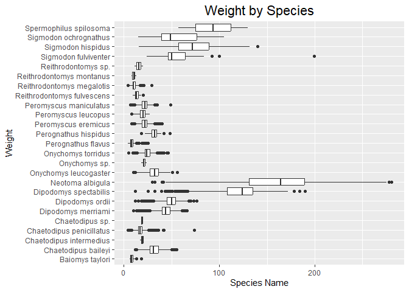<!-- -->

6. Add another layer to your answer from #5 using `geom_point` to get an idea of how many measurements were taken for each species.
**I found two ways to do this**

```r
deserts %>% 
  filter(!weight=="NA") %>% 
  ggplot(aes(x=weight,y=species))+
  geom_point(na.rm = T)+ #geom_point is used here instead!
  labs(title = "Weight by Species",
       x= "Weight",
       y= "Species")+
  theme(plot.title=element_text(size=rel(1.5),hjust=0.5))
```

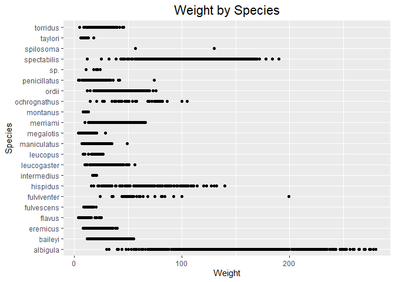<!-- -->


```r
deserts %>% 
  filter(weight != "NA") %>% 
  unite(species_name, "genus", "species", sep = " ") %>% 
  ggplot(aes(x = species_name, y = weight))+
  geom_boxplot()+
  coord_flip()+
  labs(title = "Weight by Species",
       x = "Weight",
       y = "Species Name")+
  theme(plot.title = element_text(size = rel(1.5), hjust = 0.5))+
  geom_point(aes(color = weight), size = 0.5) #Modified line of code that adds a scatter plot
```

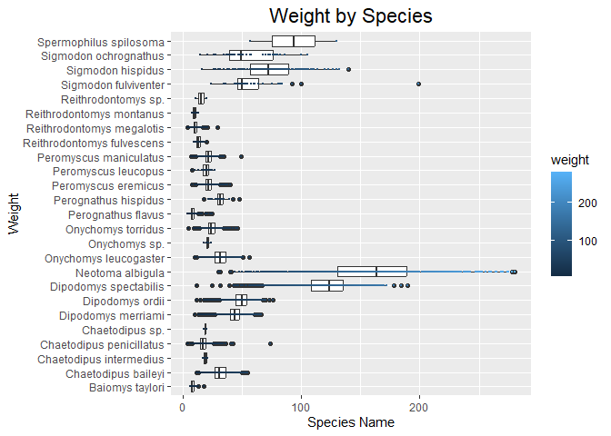<!-- -->


7. [Dipodomys merriami](https://en.wikipedia.org/wiki/Merriam's_kangaroo_rat) is the most frequently sampled animal in the study. How have the number of observations of this species changed over the years included in the study?

```r
names(deserts)
```

```
##  [1] "record_id"       "month"           "day"             "year"           
##  [5] "plot_id"         "species_id"      "sex"             "hindfoot_length"
##  [9] "weight"          "genus"           "species"         "taxa"           
## [13] "plot_type"
```

```r
deserts %>% 
  count(year) %>% #creating counts of observations by year
  ggplot(aes(x = year, y = n)) + #creating the plot
  geom_point() + #creating the scatterplot
  labs(title = "Number of Observations by Year",
       x = "Year",
       y = "Number of Observations") + #adding labels
  theme(plot.title = element_text(size = rel(1.3), hjust = 0.5)) + #resizing and moving labels
  geom_smooth(method = lm, se = T) #adding line of best fit
```

```
## `geom_smooth()` using formula = 'y ~ x'
```

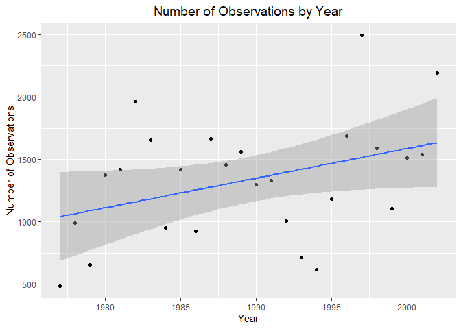<!-- -->

**I solved another way**
As a bar plot it is difficult to tell how the number of species changed over time. It seems in this example that the amount of species fluctuated over time.

```r
deserts %>% 
  filter(species_id=="DM") %>% 
  group_by(year) %>% 
  summarise(n_samples=n()) %>% 
  ggplot(aes(x=as.factor(year),y=n_samples))+
    geom_col()+
  theme(axis.text.x = element_text(angle=45, hjust=1))+
  labs(title = "DM Observations per Year",
       x="Number of Observations",
       y= "Year")
```

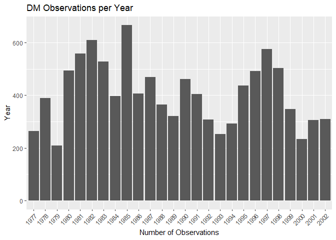<!-- -->

As time has gone on, the number of observations seems to have a positive correlation which could mean the more species were observed over time due to biological factors like predators typically preferring larger prey or the ability for Merriam's Kangaroos to produce up to three litters per year. 

8. What is the relationship between `weight` and `hindfoot` length? Consider whether or not over plotting is an issue.

```r
deserts %>% 
  ggplot(aes(x = weight, y = hindfoot_length)) + 
  geom_jitter() + #reducing overplotting
  labs(title = "Hindfoot Length vs Weight",
       x = "Weight",
       y = "Hindfoot Length") + #adding labels
  theme(plot.title = element_text(size = rel(1.5), hjust = 0.5)) + 
  geom_smooth(method = lm, se = T)
```

```
## `geom_smooth()` using formula = 'y ~ x'
```

```
## Warning: Removed 4048 rows containing non-finite values (`stat_smooth()`).
```

```
## Warning: Removed 4048 rows containing missing values (`geom_point()`).
```

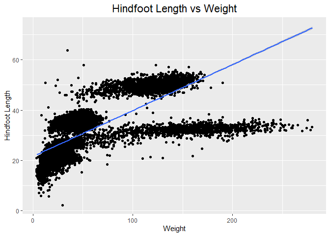<!-- -->
There is a positive correlation between weight and hindfoot length.Hindfoot length will increase with weight. Overplotting is an issue. 

**This is another method**

```r
deserts %>% 
  ggplot(aes(x=weight,y=hindfoot_length))+
  geom_point(na.rm=T,size=1.2)+
  geom_smooth(method=lm,se=F)+
  scale_y_log10()+
   theme(axis.text.x = element_text(angle=45, hjust=1))+
  labs(title = "Hindfoot Length vs. Weight",
       x="Weight",
       y= "Hindfoot Length")
```

```
## `geom_smooth()` using formula = 'y ~ x'
```

```
## Warning: Removed 4048 rows containing non-finite values (`stat_smooth()`).
```

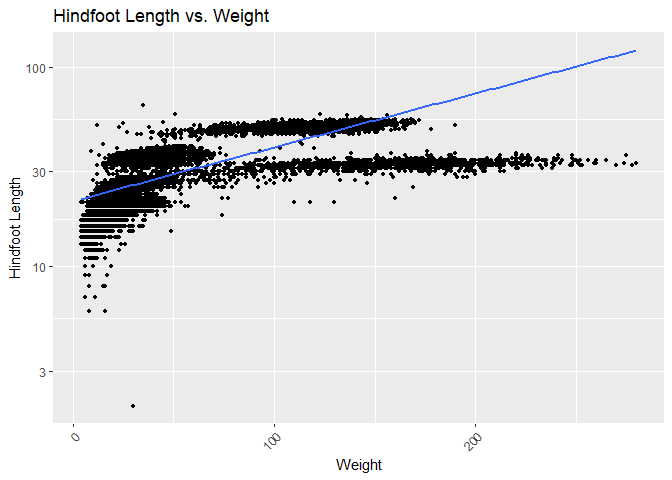<!-- -->


9. Which two species have, on average, the highest weight? Once you have identified them, make a new column that is a ratio of `weight` to `hindfoot_length`. Make a plot that shows the range of this new ratio and fill by sex.

```r
deserts %>% 
  group_by(species) %>% 
  filter(!weight=="NA") %>% 
  summarize(avg_weight = mean(weight, na.rm = T)) %>% 
  arrange(desc(avg_weight)) %>% 
  head(2, species) #displays the two species with highest average weight
```

```
## # A tibble: 2 × 2
##   species     avg_weight
##   <chr>            <dbl>
## 1 albigula          159.
## 2 spectabilis       120.
```
The two species are albigula and spectabilis with the highest mean weight!

**Plot**

```r
#New column with ratio of 'weight' to 'hind_foot' 
high_weight_desert <- deserts %>% 
  filter(species == "albigula" | species == "spectabilis") %>% 
  mutate(w_hindfoot_length_ratio = weight / hindfoot_length)
high_weight_desert 
```

```
## # A tibble: 3,756 × 14
##    record_id month   day  year plot_id species_id sex   hindfoot_length weight
##        <dbl> <dbl> <dbl> <dbl>   <dbl> <chr>      <chr>           <dbl>  <dbl>
##  1         1     7    16  1977       2 NL         M                  32     NA
##  2         2     7    16  1977       3 NL         M                  33     NA
##  3        11     7    16  1977       5 DS         F                  53     NA
##  4        17     7    16  1977       3 DS         F                  48     NA
##  5        20     7    17  1977      11 DS         F                  48     NA
##  6        22     7    17  1977      15 NL         F                  31     NA
##  7        30     7    17  1977      10 DS         F                  52     NA
##  8        38     7    17  1977      17 NL         M                  33     NA
##  9        42     7    18  1977      18 DS         F                  46     NA
## 10        58     7    18  1977      12 DS         M                  45     NA
## # ℹ 3,746 more rows
## # ℹ 5 more variables: genus <chr>, species <chr>, taxa <chr>, plot_type <chr>,
## #   w_hindfoot_length_ratio <dbl>
```


```r
high_weight_desert %>% 
  filter(sex != "NA") %>% 
  ggplot(aes(x = species, y = w_hindfoot_length_ratio, fill = sex))+
  geom_boxplot(alpha = 0.5) #use boxplot because we are finding a range of variables
```

```
## Warning: Removed 567 rows containing non-finite values (`stat_boxplot()`).
```

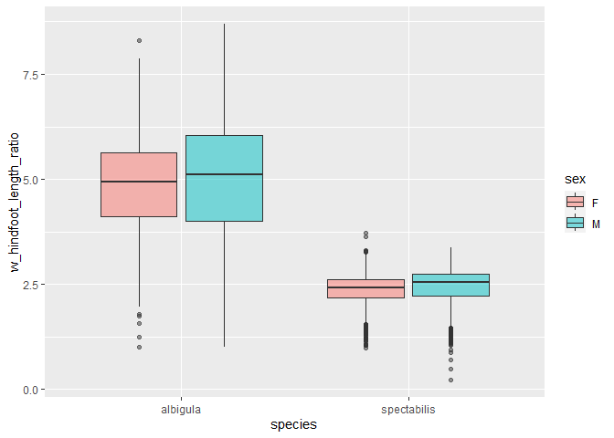<!-- -->
Another way to do the **Plot**


```r
#deserts %>% 
  #filter(species_id=="DS" | species_id =="NL") %>% 
 # filter(!weight=="NA" & !hindfoot_length=="NA" & !sex=="NA") %>% #we use 'and' for the data with NA values for our variables of interest. 
 # mutate(ratio=weight/hindfoot_length) %>%
 # select(ratio,species_id,weight,sex) %>% 
 # ggplot(aes(x=ratio,fill=sex))+
  #geom_boxplot()+
  #theme(axis.text.x = element_text(angle=45, hjust=1))+
  #labs(title = "Weight to Foot Ratios",
       #x="Ratio")
```

10. Make one plot of your choice! Make sure to include at least two of the aesthetics options you have learned.


```r
deserts %>% 
  filter(genus == "Sigmodon" & species== "hispidus") %>% 
  filter(sex!="NA") %>% 
  ggplot(aes(year, fill=sex))+
  geom_bar(position = "dodge")+
  scale_y_log10()+ #for ease of viewing
    labs(title = "Sigmodon hispidus vs. Time",
       x = "Year",
       y = "Count")
```

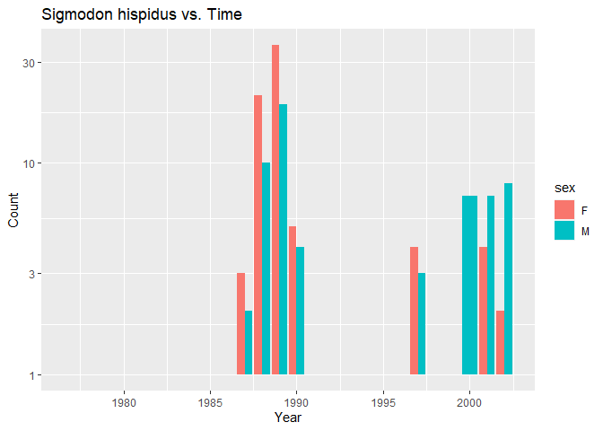<!-- -->
This code shows how the number of observations of Sigmodon hispidus has changed over time. I grouped and filled by sex. 

## Push your final code to GitHub!
Please be sure that you check the `keep md` file in the knit preferences. 
