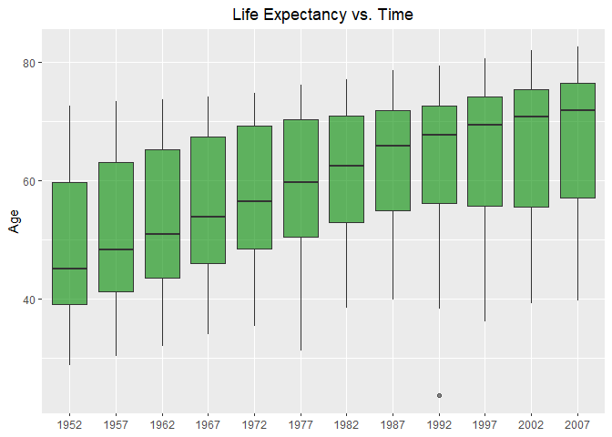
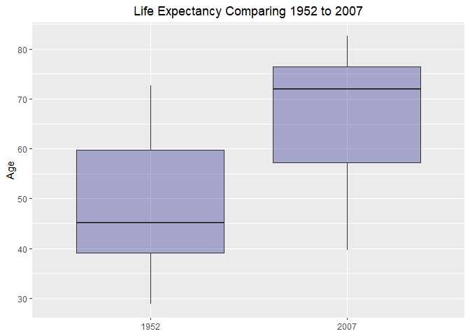
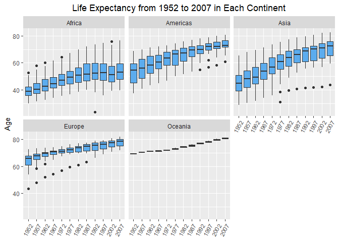
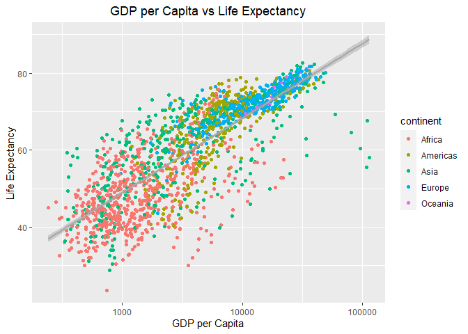
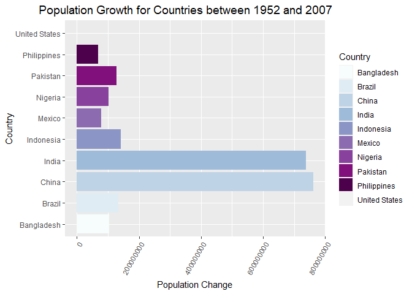
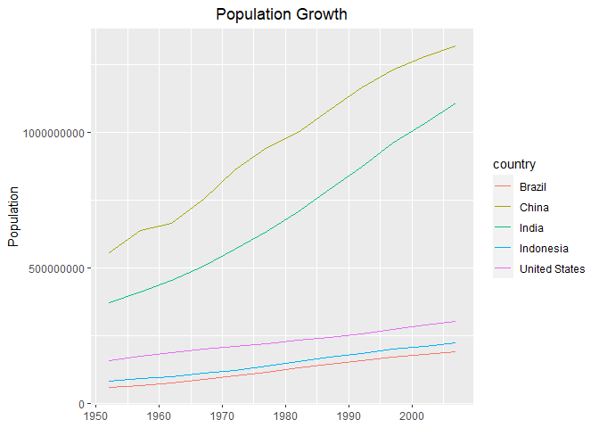
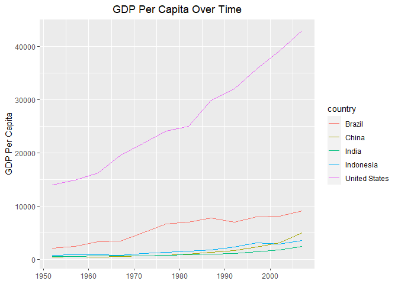
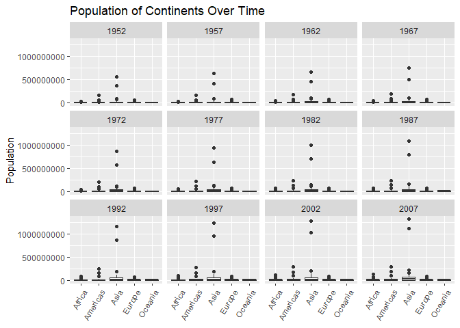

## Instructions
Answer the following questions and complete the exercises in RMarkdown. Please embed all of your code and push your final work to your repository. Your final lab report should be organized, clean, and run free from errors. Remember, you must remove the `#` for the included code chunks to run. Be sure to add your name to the author header above. For any included plots, make sure they are clearly labeled. You are free to use any plot type that you feel best communicates the results of your analysis.  

**In this homework, you should make use of the aesthetics you have learned. It's OK to be flashy!**

Make sure to use the formatting conventions of RMarkdown to make your report neat and clean!  

## Load the libraries

```r
library(tidyverse)
library(janitor)
library(here)
library(naniar)
```


```r
options(scipen = 999)
```

## Resources
The idea for this assignment came from [Rebecca Barter's](http://www.rebeccabarter.com/blog/2017-11-17-ggplot2_tutorial/) ggplot tutorial so if you get stuck this is a good place to have a look.  

## Gapminder
For this assignment, we are going to use the dataset [gapminder](https://cran.r-project.org/web/packages/gapminder/index.html). Gapminder includes information about economics, population, and life expectancy from countries all over the world. You will need to install it before use. This is the same data that we will use for midterm 2 so this is good practice.

```r
#install.packages("gapminder")
library("gapminder")
```

## Questions
The questions below are open-ended and have many possible solutions. Your approach should, where appropriate, include numerical summaries and visuals. Be creative; assume you are building an analysis that you would ultimately present to an audience of stakeholders. Feel free to try out different `geoms` if they more clearly present your results.  

**1. Use the function(s) of your choice to get an idea of the overall structure of the data frame, including its dimensions, column names, variable classes, etc. As part of this, determine how NAs are treated in the data.**

```r
gapminder <- gapminder %>% clean_names() #be able to view gapminder
```


```r
glimpse(gapminder) #overall structure
```

```
## Rows: 1,704
## Columns: 6
## $ country    <fct> "Afghanistan", "Afghanistan", "Afghanistan", "Afghanistan",…
## $ continent  <fct> Asia, Asia, Asia, Asia, Asia, Asia, Asia, Asia, Asia, Asia,…
## $ year       <int> 1952, 1957, 1962, 1967, 1972, 1977, 1982, 1987, 1992, 1997,…
## $ life_exp   <dbl> 28.801, 30.332, 31.997, 34.020, 36.088, 38.438, 39.854, 40.…
## $ pop        <int> 8425333, 9240934, 10267083, 11537966, 13079460, 14880372, 1…
## $ gdp_percap <dbl> 779.4453, 820.8530, 853.1007, 836.1971, 739.9811, 786.1134,…
```

```r
dim(gapminder) #dimensions 6var.; 1704 obs.
```

```
## [1] 1704    6
```

```r
names(gapminder) #names of columns
```

```
## [1] "country"    "continent"  "year"       "life_exp"   "pop"       
## [6] "gdp_percap"
```
#check for NAs 

```r
miss_var_summary(gapminder)
```

```
## # A tibble: 6 × 3
##   variable   n_miss pct_miss
##   <chr>       <int>    <dbl>
## 1 country         0        0
## 2 continent       0        0
## 3 year            0        0
## 4 life_exp        0        0
## 5 pop             0        0
## 6 gdp_percap      0        0
```


```r
summary(gapminder)
```

```
##         country        continent        year         life_exp    
##  Afghanistan:  12   Africa  :624   Min.   :1952   Min.   :23.60  
##  Albania    :  12   Americas:300   1st Qu.:1966   1st Qu.:48.20  
##  Algeria    :  12   Asia    :396   Median :1980   Median :60.71  
##  Angola     :  12   Europe  :360   Mean   :1980   Mean   :59.47  
##  Argentina  :  12   Oceania : 24   3rd Qu.:1993   3rd Qu.:70.85  
##  Australia  :  12                  Max.   :2007   Max.   :82.60  
##  (Other)    :1632                                                
##       pop               gdp_percap      
##  Min.   :     60011   Min.   :   241.2  
##  1st Qu.:   2793664   1st Qu.:  1202.1  
##  Median :   7023596   Median :  3531.8  
##  Mean   :  29601212   Mean   :  7215.3  
##  3rd Qu.:  19585222   3rd Qu.:  9325.5  
##  Max.   :1318683096   Max.   :113523.1  
## 
```

**2. Among the interesting variables in gapminder is life expectancy. How has global life expectancy changed between 1952 and 2007?**

```r
gapminder %>%
  mutate(year = as.factor(year)) %>% 
  group_by(year) %>% 
  ggplot(aes(x = year, y = life_exp)) +
  geom_boxplot(fill = "green4", alpha = 0.6) +
  labs(title = "Life Expectancy vs. Time",
       x = NULL,
       y = "Age") +
  theme(plot.title = element_text(hjust = 0.5))
```

<!-- -->
It seems to have increased over the years! 

**3. How do the distributions of life expectancy compare for the years 1952 and 2007?**

```r
gapminder %>% 
  filter(year == 1952 | year == 2007) %>% 
  mutate(year = as.factor(year)) %>% #year changed to fct from int
  group_by(year) %>% 
  ggplot(aes(x = year, y = life_exp))+
  geom_boxplot(fill="navy", alpha = 0.3)+
  labs(title = "Life Expectancy Comparing 1952 to 2007", 
       x = NULL, 
       y = "Age")+
  theme(plot.title = element_text(hjust = 0.5))
```

<!-- -->
People live longer now than they did in the past!

**4. Your answer above doesn't tell the whole story since life expectancy varies by region. Make a summary that shows the min, mean, and max life expectancy by continent for all years represented in the data.**

```r
gapminder %>% 
  group_by(continent, year) %>% 
  summarize(min = min(life_exp),
            mean = mean(life_exp), 
            max = max(life_exp))
```

```
## `summarise()` has grouped output by 'continent'. You can override using the
## `.groups` argument.
```

```
## # A tibble: 60 × 5
## # Groups:   continent [5]
##    continent  year   min  mean   max
##    <fct>     <int> <dbl> <dbl> <dbl>
##  1 Africa     1952  30    39.1  52.7
##  2 Africa     1957  31.6  41.3  58.1
##  3 Africa     1962  32.8  43.3  60.2
##  4 Africa     1967  34.1  45.3  61.6
##  5 Africa     1972  35.4  47.5  64.3
##  6 Africa     1977  36.8  49.6  67.1
##  7 Africa     1982  38.4  51.6  69.9
##  8 Africa     1987  39.9  53.3  71.9
##  9 Africa     1992  23.6  53.6  73.6
## 10 Africa     1997  36.1  53.6  74.8
## # ℹ 50 more rows
```

**5. How has life expectancy changed between 1952-2007 for each continent?**

```r
gapminder %>% 
  mutate(year = as.factor(year)) %>% 
  ggplot(aes(x = year, y  = life_exp))+
  geom_boxplot(fill = "steelblue2")+
  facet_wrap(~continent)+
  labs(title = "Life Expectancy from 1952 to 2007 in Each Continent",
       x = NULL, 
       y = "Age")+
  theme(plot.title = element_text(hjust = 0.5),
        axis.title.x = element_text(angle = 60, hjust = 1))+ 
  theme(axis.text.x = element_text(angle = 60, hjust=1))
```

<!-- -->
The all the continents seem to follow the same trend that life expectancy is increasing as time gets later and later. 

**6. We are interested in the relationship between per capita GDP and life expectancy; i.e. does having more money help you live longer?**

```r
gapminder %>% 
  ggplot(aes(x = gdp_percap, y = life_exp, color=continent))+
  geom_point()+
  geom_smooth(method = lm, color = "darkgrey")+
  scale_x_log10()+
  labs(title = "GDP per Capita vs Life Expectancy", 
       x = "GDP per Capita", 
       y = "Life Expectancy")+
  theme(plot.title = element_text(hjust = 0.5))
```

```
## `geom_smooth()` using formula = 'y ~ x'
```

<!-- -->
There is a positive correlation meaning that having more money could allow you to live longer (maybe you have better access to medical coverage).  

**7. Which countries have had the largest population growth since 1952?**

```r
gapminder %>% 
  group_by(country) %>% 
  summarise(min = min(pop), 
            max = max(pop), 
            change = max - min) %>% 
  arrange(desc(change))
```

```
## # A tibble: 142 × 4
##    country             min        max    change
##    <fct>             <int>      <int>     <int>
##  1 China         556263527 1318683096 762419569
##  2 India         372000000 1110396331 738396331
##  3 United States 157553000  301139947 143586947
##  4 Indonesia      82052000  223547000 141495000
##  5 Brazil         56602560  190010647 133408087
##  6 Pakistan       41346560  169270617 127924057
##  7 Bangladesh     46886859  150448339 103561480
##  8 Nigeria        33119096  135031164 101912068
##  9 Mexico         30144317  108700891  78556574
## 10 Philippines    22438691   91077287  68638596
## # ℹ 132 more rows
```
^The countries are listed here! China has one of the largest changes. 


```r
#This is another way to approach the problem! 
gapminder %>% 
  filter(year == "1952" | year == "2007") %>% 
  select(country, continent, year, pop) %>% 
  pivot_wider(names_from = year,
              values_from = pop) %>% 
  clean_names() %>% 
  mutate(pop_change = x2007 - x1952) %>% 
  arrange(desc(pop_change)) %>% 
  head(10) %>% 
  ggplot(aes(x = country, y = pop_change, fill = country)) + #creating the plot
  geom_col() + #creating a boxplot
  coord_flip() +
  scale_fill_brewer(palette = "BuPu") + #choosing the color scheme
  labs(title = "Population Growth for Countries between 1952 and 2007",
       x = "Country",
       y = "Population Change",
       fill = "Country") + #adding labels
  theme(plot.title = element_text(size = rel(1.3), hjust = 0.8))+
  theme(axis.text.x = element_text(angle = 60, hjust=1))
```

```
## Warning in RColorBrewer::brewer.pal(n, pal): n too large, allowed maximum for palette BuPu is 9
## Returning the palette you asked for with that many colors
```

<!-- -->


**8. Use your results from the question above to plot population growth for the top five countries since 1952.**

```r
gapminder %>%
  filter(country == "China" | country == "India" | country == "United States" | country == "Indonesia" | country == "Brazil") %>%
  ggplot(aes(x = year, y = pop)) +
  geom_line(aes(color = country)) +
  labs(title = "Population Growth",
       y = "Population",
       x = NULL) +
  theme(plot.title = element_text(hjust = 0.5))
```

<!-- -->


**9. How does per capita GDP growth compare between these same five countries?**

```r
gapminder %>%
  filter(country == "China" | country == "India" | country == "United States" | country == "Indonesia" | country == "Brazil") %>%
  ggplot(aes(x = year)) +
  geom_line(aes(y = gdp_percap, color = country)) +
  labs(title = "GDP Per Capita Over Time",
       y = "GDP Per Capita",
       x = NULL) +
  theme(plot.title = element_text(hjust = 0.5))
```

<!-- -->

**10. Make one plot of your choice that uses faceting!**

```r
gapminder %>% 
  ggplot(aes(x = continent, y = pop))+
  geom_boxplot()+
  facet_wrap(~year)+
  labs(title = "Population of Continents Over Time", 
       y = "Population", 
       x = NULL)+
  theme(axis.text.x = element_text(angle = 60, hjust = 1))
```

<!-- -->

```r
#facet_wrap makes a ribbon of panels by a specified categorical variable. This shows all the continenets through the years and compares their population. 
```


## Push your final code to GitHub!
Please be sure that you check the `keep md` file in the knit preferences. 
