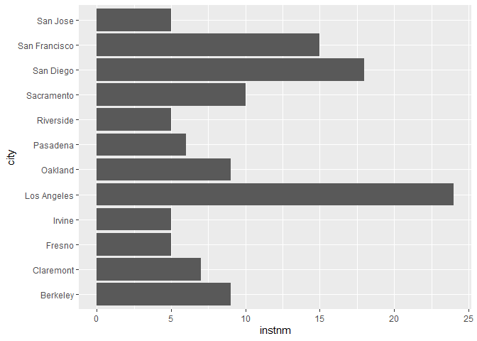
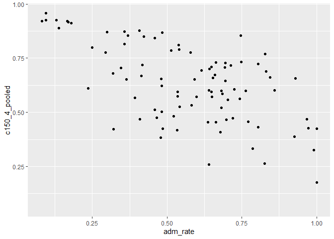
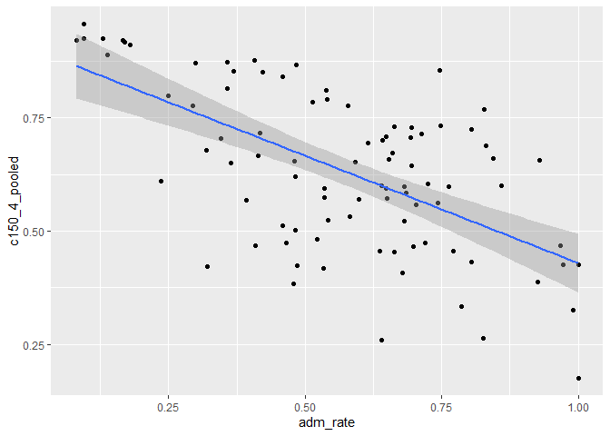
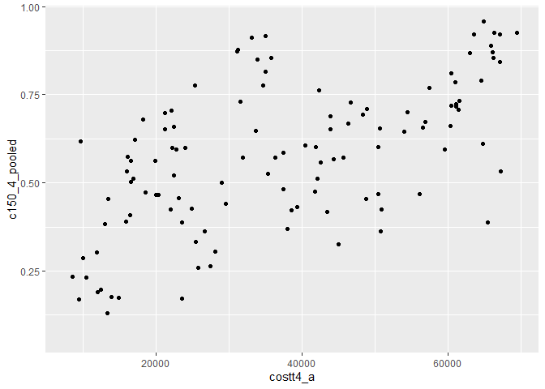
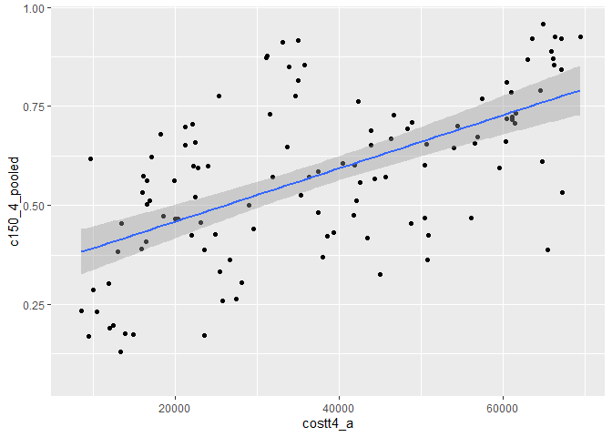
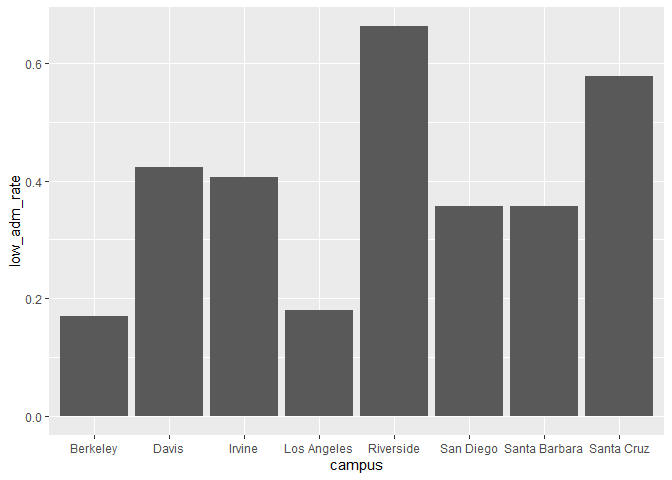
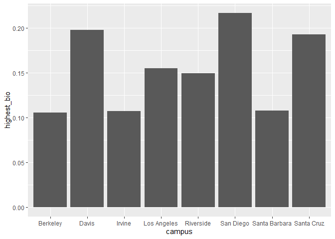

## Instructions
Answer the following questions and complete the exercises in RMarkdown. Please embed all of your code and push your final work to your repository. Your final lab report should be organized, clean, and run free from errors. Remember, you must remove the `#` for the included code chunks to run. Be sure to add your name to the author header above.  

Make sure to use the formatting conventions of RMarkdown to make your report neat and clean!  

## Load the libraries

```r
library(tidyverse)
library(janitor)
library(here)
library(naniar)
```

For this homework, we will take a departure from biological data and use data about California colleges. These data are a subset of the national college scorecard (https://collegescorecard.ed.gov/data/). Load the `ca_college_data.csv` as a new object called `colleges`.

```r
colleges <- read_csv("data/ca_college_data.csv")
```

```
## Rows: 341 Columns: 10
## ── Column specification ────────────────────────────────────────────────────────
## Delimiter: ","
## chr (4): INSTNM, CITY, STABBR, ZIP
## dbl (6): ADM_RATE, SAT_AVG, PCIP26, COSTT4_A, C150_4_POOLED, PFTFTUG1_EF
## 
## ℹ Use `spec()` to retrieve the full column specification for this data.
## ℹ Specify the column types or set `show_col_types = FALSE` to quiet this message.
```

The variables are a bit hard to decipher, here is a key:  

INSTNM: Institution name  
CITY: California city  
STABBR: Location state  
ZIP: Zip code  
ADM_RATE: Admission rate  
SAT_AVG: SAT average score  
PCIP26: Percentage of degrees awarded in Biological And Biomedical Sciences  
COSTT4_A: Annual cost of attendance  
C150_4_POOLED: 4-year completion rate  
PFTFTUG1_EF: Percentage of undergraduate students who are first-time, full-time degree/certificate-seeking undergraduate students  

1. Use your preferred function(s) to have a look at the data and get an idea of its structure. Make sure you summarize NA's and determine whether or not the data are tidy. You may also consider dealing with any naming issues.

```r
colleges <- clean_names(colleges)
```


```r
glimpse(colleges)
```

```
## Rows: 341
## Columns: 10
## $ instnm        <chr> "Grossmont College", "College of the Sequoias", "College…
## $ city          <chr> "El Cajon", "Visalia", "San Mateo", "Ventura", "Oxnard",…
## $ stabbr        <chr> "CA", "CA", "CA", "CA", "CA", "CA", "CA", "CA", "CA", "C…
## $ zip           <chr> "92020-1799", "93277-2214", "94402-3784", "93003-3872", …
## $ adm_rate      <dbl> NA, NA, NA, NA, NA, NA, NA, NA, NA, NA, NA, NA, NA, NA, …
## $ sat_avg       <dbl> NA, NA, NA, NA, NA, NA, NA, NA, NA, NA, NA, NA, NA, NA, …
## $ pcip26        <dbl> 0.0016, 0.0066, 0.0038, 0.0035, 0.0085, 0.0151, 0.0000, …
## $ costt4_a      <dbl> 7956, 8109, 8278, 8407, 8516, 8577, 8580, 9181, 9281, 93…
## $ c150_4_pooled <dbl> NA, NA, NA, NA, NA, NA, 0.2334, NA, NA, NA, NA, 0.1704, …
## $ pftftug1_ef   <dbl> 0.3546, 0.5413, 0.3567, 0.3824, 0.2753, 0.4286, 0.2307, …
```


```r
anyNA(colleges)
```

```
## [1] TRUE
```

2. Which cities in California have the highest number of colleges?

```r
colleges %>% 
  count(city) %>% 
  arrange(desc(n))
```

```
## # A tibble: 161 × 2
##    city              n
##    <chr>         <int>
##  1 Los Angeles      24
##  2 San Diego        18
##  3 San Francisco    15
##  4 Sacramento       10
##  5 Berkeley          9
##  6 Oakland           9
##  7 Claremont         7
##  8 Pasadena          6
##  9 Fresno            5
## 10 Irvine            5
## # ℹ 151 more rows
```

The cities with the highest number of colleges is Los Angeles(24), San Diego(18), and San Francisco(15). 


```r
#colleges %>% 
  #group_by(city) %>% 
  #summarise(instnm=n_distinct(instnm)) %>% 
  #arrange(-instnm)
```


3. Based on your answer to #2, make a plot that shows the number of colleges in the top 10 cities.

```r
colleges %>% 
  group_by(city) %>% 
  summarise(instnm=n_distinct(instnm)) %>% #summarize by institution name
  top_n(10, instnm) %>% #top_n is a function 
  ggplot(aes(x = city, y = instnm))+
  geom_col()+ #use this because we have x and y 
  coord_flip() #the city names are too long so, flip
```

<!-- -->

```r
#colleges %>% 
  #count(city) %>% 
  #top_n(10,n) %>% 
  #ggplot(aes(y=city, x=n))+
  #geom_col()
```

4. The column `COSTT4_A` is the annual cost of each institution. Which city has the highest average cost? Where is it located?

```r
colleges %>% 
  filter(costt4_a!="NA") %>% 
  group_by(city, instnm) %>%
  summarise(avg_cost=mean(costt4_a), .groups= 'keep') %>% 
  arrange(-avg_cost)
```

```
## # A tibble: 217 × 3
## # Groups:   city, instnm [217]
##    city          instnm                                        avg_cost
##    <chr>         <chr>                                            <dbl>
##  1 Claremont     Harvey Mudd College                              69355
##  2 Los Angeles   Southern California Institute of Architecture    67225
##  3 Los Angeles   University of Southern California                67064
##  4 Los Angeles   Occidental College                               67046
##  5 Claremont     Claremont McKenna College                        66325
##  6 Malibu        Pepperdine University                            66152
##  7 Claremont     Scripps College                                  66060
##  8 Claremont     Pitzer College                                   65880
##  9 San Francisco San Francisco Art Institute                      65453
## 10 Claremont     Pomona College                                   64870
## # ℹ 207 more rows
```

The city with the highest average cost is Claremont $66,498.00. Claremont is located at the east end of Los Angeles County in California. The college is Harvey Mudd. 


```r
#colleges %>% 
  #group_by(city, instnm) %>% 
  #summarise(avg_cost = mean(costt4_a, na.rm = T)) %>% #calculates the average annual cost of each institution
  #arrange(desc(avg_cost))
```
5. Based on your answer to #4, make a plot that compares the cost of the individual colleges in the most expensive city. Bonus! Add UC Davis here to see how it compares :>).

```r
colleges %>% 
  filter(city=="Claremont" | instnm == "University of California-Davis") %>% 
  ggplot(aes(x=instnm, y=costt4_a))+
  geom_col()+
  coord_flip()
```

```
## Warning: Removed 2 rows containing missing values (`position_stack()`).
```

<!-- -->


```r
#colleges %>% 
  #filter(costt4_a!="NA") %>% 
  #select(instnm, city, costt4_a) %>%
  #top_n(10, instnm) %>% 
  #ggplot(aes(x=instnm, y=city))+
  #geom_col()+
  #coord_flip()
```

6. The column `ADM_RATE` is the admissions rate by college and `C150_4_POOLED` is the four-year completion rate. Use a scatterplot to show the relationship between these two variables. What do you think this means?

```r
ggplot(data = colleges, mapping = aes(x = adm_rate, y = c150_4_pooled))+
  geom_point()
```

```
## Warning: Removed 251 rows containing missing values (`geom_point()`).
```

<!-- -->
There seems to be high negative correlation between the admittance rate and the four-year completion rate. It seems like the higher the admittance rate the less likely students are to complete their degree in four years.  

```r
colleges %>% 
  select(adm_rate, c150_4_pooled) %>% 
  filter(adm_rate!="NA" & c150_4_pooled!="NA") %>% 
  ggplot(aes(x=adm_rate, y=c150_4_pooled))+
  geom_point()+
  geom_smooth(method = lm, se=T) #This piece of code has the line
```

```
## `geom_smooth()` using formula = 'y ~ x'
```

<!-- -->


7. Is there a relationship between cost and four-year completion rate? (You don't need to do the stats, just produce a plot). What do you think this means?

```r
ggplot(data = colleges, mapping = aes(x = costt4_a, y = c150_4_pooled))+
  geom_point()
```

```
## Warning: Removed 225 rows containing missing values (`geom_point()`).
```

<!-- -->
There is a positive correlation (it is not that clear since the data points are not clearly showcasing a trend) between the cost and the four year attendance rate. This could mean that the more money someone spends on attending college per year the more likely they are to graduate in four years. 

```r
colleges %>% 
  ggplot(aes(x=costt4_a, y= c150_4_pooled))+
  geom_point(na.rm = T)+
  geom_smooth(method = lm,se = T) #This code shows the line
```

```
## `geom_smooth()` using formula = 'y ~ x'
```

```
## Warning: Removed 225 rows containing non-finite values (`stat_smooth()`).
```

<!-- -->


8. The column titled `INSTNM` is the institution name. We are only interested in the University of California colleges. Make a new data frame that is restricted to UC institutions. You can remove `Hastings College of Law` and `UC San Francisco` as we are only interested in undergraduate institutions.

```r
univ_calif_final <- colleges %>%
  select(instnm, city, stabbr, zip, adm_rate, sat_avg, pcip26, costt4_a, c150_4_pooled, pftftug1_ef) %>% 
  separate(instnm, into = c("univ", "campus"), sep = "-") %>% 
  filter(univ == "University of California" & !campus %in% c("Hastings College of Law", "San Francisco"))
```

```
## Warning: Expected 2 pieces. Additional pieces discarded in 9 rows [140, 145, 165, 173,
## 177, 292, 298, 299, 300].
```

```
## Warning: Expected 2 pieces. Missing pieces filled with `NA` in 264 rows [1, 2, 3, 4, 5,
## 6, 7, 8, 9, 10, 11, 12, 13, 14, 15, 16, 17, 18, 19, 20, ...].
```

```r
univ_calif_final
```

```
## # A tibble: 8 × 11
##   univ  campus city  stabbr zip   adm_rate sat_avg pcip26 costt4_a c150_4_pooled
##   <chr> <chr>  <chr> <chr>  <chr>    <dbl>   <dbl>  <dbl>    <dbl>         <dbl>
## 1 Univ… San D… La J… CA     92093    0.357    1324  0.216    31043         0.872
## 2 Univ… Irvine Irvi… CA     92697    0.406    1206  0.107    31198         0.876
## 3 Univ… River… Rive… CA     92521    0.663    1078  0.149    31494         0.73 
## 4 Univ… Los A… Los … CA     9009…    0.180    1334  0.155    33078         0.911
## 5 Univ… Davis  Davis CA     9561…    0.423    1218  0.198    33904         0.850
## 6 Univ… Santa… Sant… CA     9506…    0.578    1201  0.193    34608         0.776
## 7 Univ… Berke… Berk… CA     94720    0.169    1422  0.105    34924         0.916
## 8 Univ… Santa… Sant… CA     93106    0.358    1281  0.108    34998         0.816
## # ℹ 1 more variable: pftftug1_ef <dbl>
```

Remove `Hastings College of Law` and `UC San Francisco` and store the final data frame as a new object `univ_calif_final`.

Use `separate()` to separate institution name into two new columns "UNIV" and "CAMPUS".

9. The column `ADM_RATE` is the admissions rate by campus. Which UC has the lowest and highest admissions rates? Produce a numerical summary and an appropriate plot.

```r
univ_calif_final %>%
  group_by(campus) %>% 
  summarise(low_adm_rate=min(adm_rate)) %>% 
  arrange(-low_adm_rate)
```

```
## # A tibble: 8 × 2
##   campus        low_adm_rate
##   <chr>                <dbl>
## 1 Riverside            0.663
## 2 Santa Cruz           0.578
## 3 Davis                0.423
## 4 Irvine               0.406
## 5 Santa Barbara        0.358
## 6 San Diego            0.357
## 7 Los Angeles          0.180
## 8 Berkeley             0.169
```

The UC with the highest admission rate is Riverside (0.6634). The UC with the lowest admission rate is Berkeley (0.1693). 


```r
univ_calif_final %>% 
  group_by(campus) %>% 
  summarise(low_adm_rate=min(adm_rate)) %>% 
  ggplot(aes(x=campus, y=low_adm_rate))+
  geom_col()
```

<!-- -->

10. If you wanted to get a degree in biological or biomedical sciences, which campus confers the majority of these degrees? Produce a numerical summary and an appropriate plot.

```r
univ_calif_final %>% 
  group_by(campus) %>% 
  summarise(highest_bio=max(pcip26)) %>% 
  arrange(-highest_bio)
```

```
## # A tibble: 8 × 2
##   campus        highest_bio
##   <chr>               <dbl>
## 1 San Diego           0.216
## 2 Davis               0.198
## 3 Santa Cruz          0.193
## 4 Los Angeles         0.155
## 5 Riverside           0.149
## 6 Santa Barbara       0.108
## 7 Irvine              0.107
## 8 Berkeley            0.105
```
UC San Diego is best for biological or biomedical sciences. For that field it has (0.2165) degrees. 


```r
univ_calif_final %>% 
  group_by(campus) %>% 
  summarise(highest_bio=max(pcip26)) %>% 
  ggplot(aes(x=campus, y=highest_bio))+
  geom_col()
```

<!-- -->

## Knit Your Output and Post to [GitHub](https://github.com/FRS417-DataScienceBiologists)
