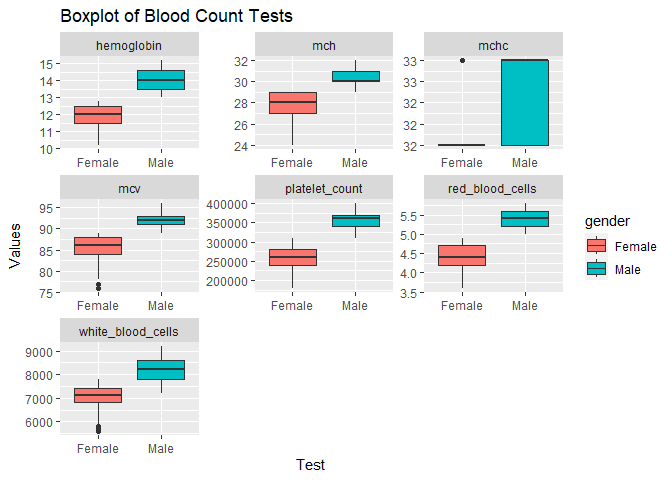
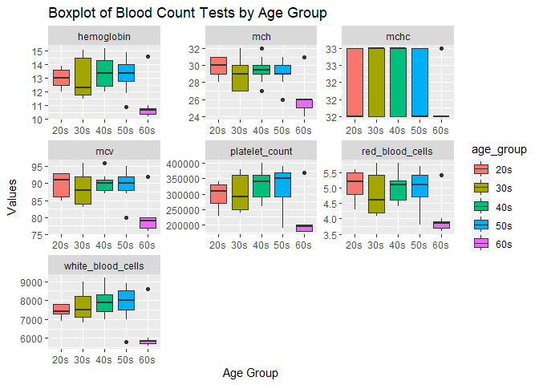

## Instructions
This homework is a bit less traditional this week. There are some errors in the code below. In addition add notes and titles to the code chunks that explains what the code chunck does. Use AI tools, notes from class, or any other resources to help fix the errors. Feel free to edit any plots to your preference. Don't forget to answer the two questions at the bottom. Upon completion, you should not have to '#' out any of the code chunks.

Push your final work to your repository. Your final lab report should be organized, clean, and run free from errors. Remember, you must remove the `#` for the included code chunks to run. Be sure to add your name to the author header above.   

Again make sure to use the formatting conventions of RMarkdown to make your report neat and clean!  


```r
library(tidyverse)
```

```
## ── Attaching core tidyverse packages ──────────────────────── tidyverse 2.0.0 ──
## ✔ dplyr     1.1.4     ✔ readr     2.1.5
## ✔ forcats   1.0.0     ✔ stringr   1.5.1
## ✔ ggplot2   3.4.4     ✔ tibble    3.2.1
## ✔ lubridate 1.9.3     ✔ tidyr     1.3.1
## ✔ purrr     1.0.2     
## ── Conflicts ────────────────────────────────────────── tidyverse_conflicts() ──
## ✖ dplyr::filter() masks stats::filter()
## ✖ dplyr::lag()    masks stats::lag()
## ℹ Use the conflicted package (<http://conflicted.r-lib.org/>) to force all conflicts to become errors
```

```r
library(janitor)
```

```
## 
## Attaching package: 'janitor'
## 
## The following objects are masked from 'package:stats':
## 
##     chisq.test, fisher.test
```

```r
library(dplyr)
```


```r
getwd()
```

```
## [1] "C:/Users/liana/Desktop/BIS15/BIS15W2024_lwilliams/lab15"
```

1.Load the Data 

```r
blood_count <- read_csv("/Users/liana/Desktop/BIS15/BIS15W2024_lwilliams/lab15/data/blood_count_dataset.csv") %>% clean_names() #the file name was wrong
```

```
## Rows: 417 Columns: 9
## ── Column specification ────────────────────────────────────────────────────────
## Delimiter: ","
## chr (1): Gender
## dbl (8): Age, Hemoglobin, Platelet_Count, White_Blood_Cells, Red_Blood_Cells...
## 
## ℹ Use `spec()` to retrieve the full column specification for this data.
## ℹ Specify the column types or set `show_col_types = FALSE` to quiet this message.
```

2. Find the Struture of the Data

```r
glimpse(blood_count) #glimpse was spelled wrong
```

```
## Rows: 417
## Columns: 9
## $ age               <dbl> 68, 25, 57, 28, 38, 47, 37, 30, 35, 22, 41, 34, 40, …
## $ gender            <chr> "Female", "Male", "Male", "Female", "Male", "Female"…
## $ hemoglobin        <dbl> 10.4, 13.8, 13.5, 12.7, 14.9, 12.0, 14.5, 11.8, 11.5…
## $ platelet_count    <dbl> 180000, 320000, 370000, 290000, 380000, 260000, 3800…
## $ white_blood_cells <dbl> 5700, 7500, 8500, 7800, 8700, 7000, 8700, 7000, 7100…
## $ red_blood_cells   <dbl> 3.7, 5.4, 5.1, 4.8, 5.7, 4.4, 5.7, 4.2, 4.2, 5.6, 4.…
## $ mcv               <dbl> 77, 92, 90, 86, 95, 87, 95, 84, 84, 93, 88, 85, 96, …
## $ mch               <dbl> 25, 30, 29, 29, 31, 28, 31, 27, 27, 31, 29, 28, 32, …
## $ mchc              <dbl> 32, 32, 32, 33, 33, 32, 33, 32, 32, 32, 33, 32, 33, …
```

3. Calculate the min, mean, and max of the values of red_blood_cells

```r
blood_count %>% 
  group_by(gender) %>% 
  summarize(min=min(red_blood_cells), #missing a comma
            mean=mean(red_blood_cells), #mean was spelled wrong
            max=max(red_blood_cells)) #fix the capitalization error of red_blood_cells by doing clean_names() on the dataset
```

```
## # A tibble: 2 × 4
##   gender   min  mean   max
##   <chr>  <dbl> <dbl> <dbl>
## 1 Female   3.6  4.36   4.9
## 2 Male     5    5.38   5.8
```


4. Filter the data to include only rows where gender is male. Then, select columns 3 to 9. 

```r
options(scipen = 999, digits = 2)

blood_count %>% 
  filter(gender == "Male") %>% #Uncapitalize gender and add an extra = sign and capitalize Male to match the data
  select(3:9) %>% #change [] to ()
  colMeans(na.rm = TRUE)
```

```
##        hemoglobin    platelet_count white_blood_cells   red_blood_cells 
##              14.0          355598.1            8184.7               5.4 
##               mcv               mch              mchc 
##              92.3              30.4              32.6
```

5. Filter the data to include only rows where gender is female. Then, select columns 3 to 9.

```r
blood_count %>% #fix the typo
  filter(gender == "Female") %>% #fix the pipe operator and add an extra = sign
  select(3:9) %>% #change [] to ()
  colMeans(na.rm = T)
```

```
##        hemoglobin    platelet_count white_blood_cells   red_blood_cells 
##              11.9          255913.5            6967.8               4.4 
##               mcv               mch              mchc 
##              84.9              27.7              32.2
```


6.Create a boxplot of the blood count tests that facet by the test type. 

```r
blood_count %>%
  pivot_longer(cols = 3:9, names_to = "test", values_to = "values") %>%
  ggplot(aes(x = gender, y = values, fill = gender)) +
  geom_boxplot() +
  facet_wrap(~ test, scales = "free") +
  labs(title = "Boxplot of Blood Count Tests",
       x = "Test",
       y = "Values")
```

<!-- -->

7. Create a grouping variable age_group based on the specified age ranges, then display the first few rows of the data.

```r
grouped_bc <- blood_count %>%
  mutate(age_group = case_when( #replace change to mutate since change is not a standard function in R 
    age >= 20 & age <= 29 ~ "20s",
    age >= 30 & age <= 39 ~ "30s",
    age >= 40 & age <= 49 ~ "40s",
    age >= 50 & age <= 59 ~ "50s",
    age >= 60 & age <= 70 ~ "60s")) # there were only 4 people in 70s, so I combined it with 60s

head(grouped_bc)
```

```
## # A tibble: 6 × 10
##     age gender hemoglobin platelet_count white_blood_cells red_blood_cells   mcv
##   <dbl> <chr>       <dbl>          <dbl>             <dbl>           <dbl> <dbl>
## 1    68 Female       10.4         180000              5700             3.7    77
## 2    25 Male         13.8         320000              7500             5.4    92
## 3    57 Male         13.5         370000              8500             5.1    90
## 4    28 Female       12.7         290000              7800             4.8    86
## 5    38 Male         14.9         380000              8700             5.7    95
## 6    47 Female       12           260000              7000             4.4    87
## # ℹ 3 more variables: mch <dbl>, mchc <dbl>, age_group <chr>
```

8. Create a boxplot of the blood count tests that facet by the test type and age group.

```r
grouped_bc %>%
  pivot_longer(cols = 3:9, names_to = "test", values_to = "values") %>%
  ggplot(aes(x = age_group, y = values, fill = age_group)) +
  geom_boxplot() +
  facet_wrap(~ test, scales = "free") +
  labs(title = "Boxplot of Blood Count Tests by Age Group",
       x = "Age Group",
       y = "Values")
```

<!-- -->
9. What are two drawbacks and two benefits of AI?

Two drawbacks of AI are that it can be expensive to implement and it can be difficult to understand how the AI came to a conclusion. Two benefits of AI are that it can be used to automate tasks and it can be used to make predictions based on data.

10. Do you think you will use AI for coding in the future? Why or why not?

I think I will use AI for coding in the future because it can help me to automate tasks and make predictions based on data. I am glad that I learned about the basics of R in data science because it will help me to understand how to use AI more efficiently.


## Push your final code to GitHub!
Please be sure that you check the `keep md` file in the knit preferences. 
