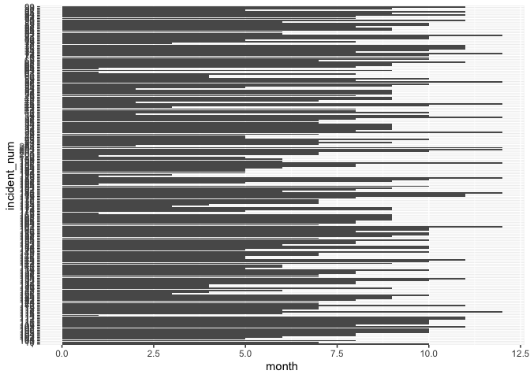
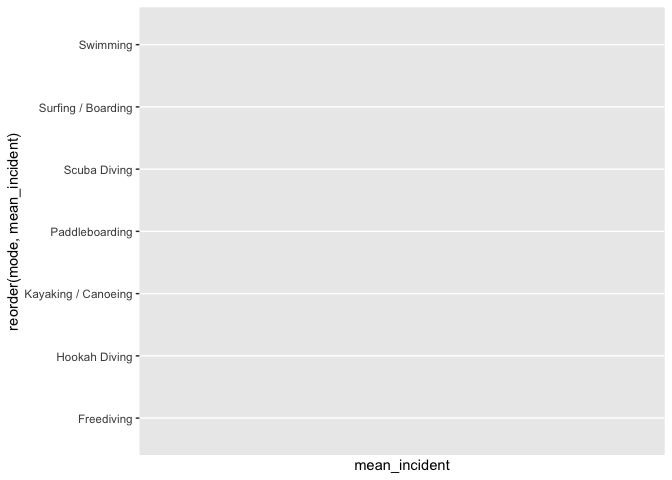

## Instructions
Answer the following questions and complete the exercises in RMarkdown. Please embed all of your code and push your final work to your repository. Your code must be organized, clean, and run free from errors. Remember, you must remove the `#` for any included code chunks to run. Be sure to add your name to the author header above. 

Your code must knit in order to be considered. If you are stuck and cannot answer a question, then comment out your code and knit the document. You may use your notes, labs, and homework to help you complete this exam. Do not use any other resources- including AI assistance.  

Don't forget to answer any questions that are asked in the prompt. Some questions will require a plot, but others do not- make sure to read each question carefully.  

For the questions that require a plot, make sure to have clearly labeled axes and a title. Keep your plots clean and professional-looking, but you are free to add color and other aesthetics.  

Be sure to follow the directions and upload your exam on Gradescope.    

## Background
In the `data` folder, you will find data about shark incidents in California between 1950-2022. The [data](https://catalog.data.gov/dataset/shark-incident-database-california-56167) are from: State of California- Shark Incident Database.   

## Load the libraries

```r
library("tidyverse")
library("janitor")
library("naniar")
```

## Load the data
Run the following code chunk to import the data.

```r
sharks <- read_csv("data/SharkIncidents_1950_2022_220302.csv") %>% clean_names()
```

## Questions
1. (1 point) Start by doing some data exploration using your preferred function(s). What is the structure of the data? Where are the missing values and how are they represented? 

```r
glimpse(sharks) #this is the structure of the data 
```

```
## Rows: 211
## Columns: 16
## $ incident_num     <chr> "1", "2", "3", "4", "5", "6", "7", "8", "9", "10", "1…
## $ month            <dbl> 10, 5, 12, 2, 8, 4, 10, 5, 6, 7, 10, 11, 4, 5, 5, 8, …
## $ day              <dbl> 8, 27, 7, 6, 14, 28, 12, 7, 14, 28, 4, 10, 24, 19, 21…
## $ year             <dbl> 1950, 1952, 1952, 1955, 1956, 1957, 1958, 1959, 1959,…
## $ time             <chr> "12:00", "14:00", "14:00", "12:00", "16:30", "13:30",…
## $ county           <chr> "San Diego", "San Diego", "Monterey", "Monterey", "Sa…
## $ location         <chr> "Imperial Beach", "Imperial Beach", "Lovers Point", "…
## $ mode             <chr> "Swimming", "Swimming", "Swimming", "Freediving", "Sw…
## $ injury           <chr> "major", "minor", "fatal", "minor", "major", "fatal",…
## $ depth            <chr> "surface", "surface", "surface", "surface", "surface"…
## $ species          <chr> "White", "White", "White", "White", "White", "White",…
## $ comment          <chr> "Body Surfing, bit multiple times on leg, thigh and b…
## $ longitude        <chr> "-117.1466667", "-117.2466667", "-122.05", "-122.15",…
## $ latitude         <dbl> 32.58833, 32.58833, 36.62667, 36.62667, 35.13833, 35.…
## $ confirmed_source <chr> "Miller/Collier, Coronado Paper, Oceanside Paper", "G…
## $ wfl_case_number  <chr> NA, NA, NA, NA, NA, NA, NA, NA, NA, NA, NA, NA, NA, N…
```

```r
sharks #This data is in wide format! 
```

```
## # A tibble: 211 × 16
##    incident_num month   day  year time    county     location mode  injury depth
##    <chr>        <dbl> <dbl> <dbl> <chr>   <chr>      <chr>    <chr> <chr>  <chr>
##  1 1               10     8  1950 12:00   San Diego  Imperia… Swim… major  surf…
##  2 2                5    27  1952 14:00   San Diego  Imperia… Swim… minor  surf…
##  3 3               12     7  1952 14:00   Monterey   Lovers … Swim… fatal  surf…
##  4 4                2     6  1955 12:00   Monterey   Pacific… Free… minor  surf…
##  5 5                8    14  1956 16:30   San Luis … Pismo B… Swim… major  surf…
##  6 6                4    28  1957 13:30   San Luis … Morro B… Swim… fatal  surf…
##  7 7               10    12  1958 Unknown San Diego  Coronad… Swim… major  surf…
##  8 8                5     7  1959 17:30   San Franc… Baker B… Swim… fatal  surf…
##  9 9                6    14  1959 17:00   San Diego  La Jolla Free… fatal  surf…
## 10 10               7    28  1959 19:30   San Diego  La Jolla Free… minor  surf…
## # ℹ 201 more rows
## # ℹ 6 more variables: species <chr>, comment <chr>, longitude <chr>,
## #   latitude <dbl>, confirmed_source <chr>, wfl_case_number <chr>
```


```r
sharks %>% 
  naniar::miss_var_summary() 
```

```
## # A tibble: 16 × 3
##    variable         n_miss pct_miss
##    <chr>             <int>    <dbl>
##  1 wfl_case_number     202   95.7  
##  2 time                  7    3.32 
##  3 latitude              6    2.84 
##  4 longitude             5    2.37 
##  5 confirmed_source      1    0.474
##  6 incident_num          0    0    
##  7 month                 0    0    
##  8 day                   0    0    
##  9 year                  0    0    
## 10 county                0    0    
## 11 location              0    0    
## 12 mode                  0    0    
## 13 injury                0    0    
## 14 depth                 0    0    
## 15 species               0    0    
## 16 comment               0    0
```


```r
sharks %>% 
  map_df(~ sum(is.na(.))) #quick summary of the number of NAs in a variable! 
```

```
## # A tibble: 1 × 16
##   incident_num month   day  year  time county location  mode injury depth
##          <int> <int> <int> <int> <int>  <int>    <int> <int>  <int> <int>
## 1            0     0     0     0     7      0        0     0      0     0
## # ℹ 6 more variables: species <int>, comment <int>, longitude <int>,
## #   latitude <int>, confirmed_source <int>, wfl_case_number <int>
```
The missing values in the incident_num column that show up as "NOT COUNTED." There are also missing values in time, longitude, latitude, confirmed_source, and wfl_case_number. 

2. (1 point) Notice that there are some incidents identified as "NOT COUNTED". These should be removed from the data because they were either not sharks, unverified, or were provoked. It's OK to replace the `sharks` object.

```r
sharks_new <- sharks %>% 
  filter(incident_num!="NOT COUNTED") 
```


3. (3 points) Are there any "hotspots" for shark incidents in California? Make a plot that shows the total number of incidents per county. Which county has the highest number of incidents?

```r
sharks_new %>% 
  group_by(county) %>% 
  summarize(mean_incidents=mean(incident_num, na.rm=TRUE),
            total=n()) %>% 
  arrange(desc(mean_incidents)) #San Diego has the most incidents 
```

```
## Warning: There were 21 warnings in `summarize()`.
## The first warning was:
## ℹ In argument: `mean_incidents = mean(incident_num, na.rm = TRUE)`.
## ℹ In group 1: `county = "Del Norte"`.
## Caused by warning in `mean.default()`:
## ! argument is not numeric or logical: returning NA
## ℹ Run `dplyr::last_dplyr_warnings()` to see the 20 remaining warnings.
```

```
## # A tibble: 21 × 3
##    county               mean_incidents total
##    <chr>                         <dbl> <int>
##  1 Del Norte                        NA     3
##  2 Humboldt                         NA    18
##  3 Island - Catalina                NA     4
##  4 Island - Farallones              NA     7
##  5 Island - San Miguel              NA     5
##  6 Island - San Nicolas             NA     1
##  7 Island - Santa Cruz              NA     2
##  8 Island - Santa Rosa              NA     1
##  9 Los Angeles                      NA     9
## 10 Marin                            NA    16
## # ℹ 11 more rows
```

```r
sharks_new %>% 
  ggplot(aes(x=county, y=incident_num)) + 
  geom_col()+
  coord_flip()
```

<!-- -->
#Humboldt is the county with the most incidents 

4. (3 points) Are there months of the year when incidents are more likely to occur? Make a plot that shows the total number of incidents by month. Which month has the highest number of incidents? 

```r
sharks_new %>% 
  ggplot(aes(x=month, y=incident_num))+
  geom_bar(stat="identity") 
```

<!-- -->

```r
#There seems to be more incidents during the months in the middle of the year. 
```

5. (3 points) How do the number and types of injuries compare by county? Make a table (not a plot) that shows the number of injury types by county. Which county has the highest number of fatalities? 

```r
sharks_new %>% 
  group_by(injury, county) %>% 
  summarize(min = min(incident_num),
            mean = mean(incident_num), 
            max = max(incident_num))
```

```
## Warning: There were 57 warnings in `summarize()`.
## The first warning was:
## ℹ In argument: `mean = mean(incident_num)`.
## ℹ In group 1: `injury = "fatal"` and `county = "Island - San Miguel"`.
## Caused by warning in `mean.default()`:
## ! argument is not numeric or logical: returning NA
## ℹ Run `dplyr::last_dplyr_warnings()` to see the 56 remaining warnings.
```

```
## `summarise()` has grouped output by 'injury'. You can override using the
## `.groups` argument.
```

```
## # A tibble: 57 × 5
## # Groups:   injury [4]
##    injury county              min    mean max  
##    <chr>  <chr>               <chr> <dbl> <chr>
##  1 fatal  Island - San Miguel 82       NA 82   
##  2 fatal  Los Angeles         62       NA 62   
##  3 fatal  Mendocino           103      NA 103  
##  4 fatal  Monterey            3        NA 45   
##  5 fatal  San Diego           127      NA 9    
##  6 fatal  San Francisco       8        NA 8    
##  7 fatal  San Luis Obispo     100      NA 6    
##  8 fatal  San Mateo           50       NA 50   
##  9 fatal  Santa Barbara       139      NA 150  
## 10 fatal  Santa Cruz          192      NA 192  
## # ℹ 47 more rows
```


6. (2 points) In the data, `mode` refers to a type of activity. Which activity is associated with the highest number of incidents?

```r
options(scipen=999)
```


```r
sharks_new %>%
  group_by(mode) %>% 
  summarise(mean_incident=mean(incident_num, na.rm = T)) %>% 
  ggplot(aes(x=reorder(mode,mean_incident), y=mean_incident))+
  geom_col()+
  coord_flip()+
  scale_y_log10()
```

```
## Warning: There were 7 warnings in `summarise()`.
## The first warning was:
## ℹ In argument: `mean_incident = mean(incident_num, na.rm = T)`.
## ℹ In group 1: `mode = "Freediving"`.
## Caused by warning in `mean.default()`:
## ! argument is not numeric or logical: returning NA
## ℹ Run `dplyr::last_dplyr_warnings()` to see the 6 remaining warnings.
```

```
## Warning: Removed 7 rows containing missing values (`position_stack()`).
```

<!-- -->

7. (4 points) Use faceting to make a plot that compares the number and types of injuries by activity. (hint: the x axes should be the type of injury) 

```r
sharks_new %>% 
  mutate(incident_num=as.factor(incident_num)) %>% 
  ggplot(aes(x=injury, y=incident_num))+
  geom_boxplot()+
  facet_wrap(~mode)+
  theme(axis.text.x = element_text(angle = 60, hjust=1))
```

<!-- -->


8. (1 point) Which shark species is involved in the highest number of incidents?  

```r
sharks_new %>% 
  count(species) %>% 
  arrange(desc(n))
```

```
## # A tibble: 8 × 2
##   species        n
##   <chr>      <int>
## 1 White        179
## 2 Unknown       13
## 3 Hammerhead     3
## 4 Blue           2
## 5 Leopard        2
## 6 Salmon         1
## 7 Sevengill      1
## 8 Thresher       1
```
The species with the highest number of incidents is White with 179. 

9. (3 points) Are all incidents involving Great White's fatal? Make a plot that shows the number and types of injuries for Great White's only.

```r
sharks_new %>%
  filter(species=="White") %>%  #Not all injuries are fatal.
  ggplot(aes(y=incident_num, x=injury))+
  geom_col()
```

<!-- -->


## Background
Let's learn a little bit more about Great White sharks by looking at a small dataset that tracked 20 Great White's in the Fallaron Islands. The [data](https://link.springer.com/article/10.1007/s00227-007-0739-4) are from: Weng et al. (2007) Migration and habitat of white sharks (_Carcharodon carcharias_) in the eastern Pacific Ocean.

## Load the data

```r
white_sharks <- read_csv("data/White sharks tracked from Southeast Farallon Island, CA, USA, 1999 2004.csv", na = c("?", "n/a")) %>% clean_names()
```

10. (1 point) Start by doing some data exploration using your preferred function(s). What is the structure of the data? Where are the missing values and how are they represented?

```r
glimpse(white_sharks) #This shows the structure of the data (in wide format)
```

```
## Rows: 20
## Columns: 10
## $ shark           <chr> "1-M", "2-M", "3-M", "4-M", "5-F", "6-M", "7-F", "8-M"…
## $ tagging_date    <chr> "19-Oct-99", "30-Oct-99", "16-Oct-00", "5-Nov-01", "5-…
## $ total_length_cm <dbl> 402, 366, 457, 457, 488, 427, 442, 380, 450, 530, 427,…
## $ sex             <chr> "M", "M", "M", "M", "F", "M", "F", "M", "M", "F", NA, …
## $ maturity        <chr> "Mature", "Adolescent", "Mature", "Mature", "Mature", …
## $ pop_up_date     <chr> "2-Nov-99", "25-Nov-99", "16-Apr-01", "6-May-02", "19-…
## $ track_days      <dbl> 14, 26, 182, 182, 256, 275, 35, 60, 209, 91, 182, 240,…
## $ longitude       <dbl> -124.49, -125.97, -156.80, -141.47, -133.25, -138.83, …
## $ latitude        <dbl> 38.95, 38.69, 20.67, 26.39, 21.13, 26.50, 37.07, 34.93…
## $ comment         <chr> "Nearshore", "Nearshore", "To Hawaii", "To Hawaii", "O…
```


```r
naniar::miss_var_summary(white_sharks)
```

```
## # A tibble: 10 × 3
##    variable        n_miss pct_miss
##    <chr>            <int>    <dbl>
##  1 sex                  3       15
##  2 maturity             1        5
##  3 longitude            1        5
##  4 latitude             1        5
##  5 shark                0        0
##  6 tagging_date         0        0
##  7 total_length_cm      0        0
##  8 pop_up_date          0        0
##  9 track_days           0        0
## 10 comment              0        0
```

```r
white_sharks %>% 
  map_df(~ sum(is.na(.))) #quick summary of the number of NAs in a variable! 
```

```
## # A tibble: 1 × 10
##   shark tagging_date total_length_cm   sex maturity pop_up_date track_days
##   <int>        <int>           <int> <int>    <int>       <int>      <int>
## 1     0            0               0     3        1           0          0
## # ℹ 3 more variables: longitude <int>, latitude <int>, comment <int>
```
The missing values are found in sex, maturity, longitude, and latitude. 

11. (3 points) How do male and female sharks compare in terms of total length? Are males or females larger on average? Do a quick search online to verify your findings. (hint: this is a table, not a plot).  


```r
library(gtools)
```


```r
quartiles <- quantcut(white_sharks$total_length_cm)
table(quartiles)
```

```
## quartiles
## [360,400] (400,434] (434,457] (457,530] 
##         5         5         6         4
```


```r
white_sharks %>% 
  filter(sex!="NA") %>% 
  mutate(length_range=case_when(total_length_cm<360 ~"very small",
                                   total_length_cm>=400 & total_length_cm<=434 ~ "small",
                                  total_length_cm>434 & total_length_cm<=457 ~ "medium",
                                  total_length_cm>=530 ~ "large")) %>% 
  ggplot(aes(x=length_range, fill=sex))+
  geom_bar(position = "dodge", alpha=0.6, color="black")
```

<!-- -->
On average Male sharks are larger!

12. (3 points) Make a plot that compares the range of total length by sex.

```r
white_sharks %>% 
  filter(!is.na(sex)) %>% 
  ggplot(aes(x = total_length_cm, y = sex, fill=sex)) +
  geom_boxplot()+
    labs(title = "Total Length by Sex",
       x= "Total_Length_cm", 
       y="Sex")+
  coord_flip()+
  theme_light()
```

<!-- -->


13. (2 points) Using the `sharks` or the `white_sharks` data, what is one question that you are interested in exploring? Write the question and answer it using a plot or table.  

```r
#How has incident_num changed between 1950 and 2022? There have been more incidents over time. 

sharks_new %>%
  mutate(year = as.factor(year)) %>% 
  group_by(year) %>% 
  ggplot(aes(x=year, fill=year))+
  geom_bar(color="black", alpha=0.6)+
  labs(title = "Incidents between 1950 and 2022", x = "Year", y="# Incidents")+
  theme_light()
```

<!-- -->

